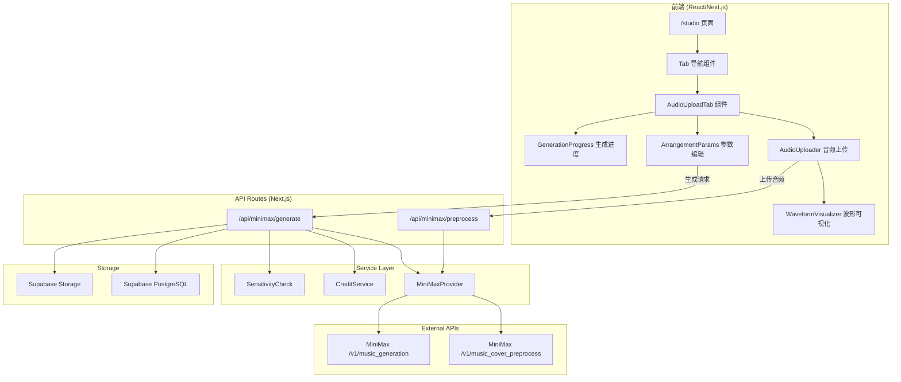
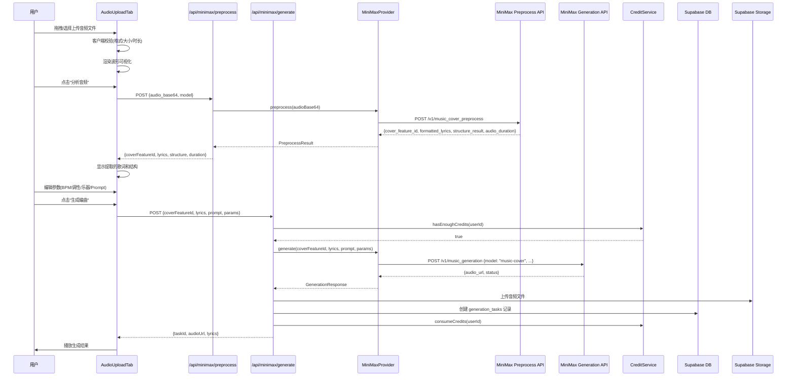

# Design Document: Audio Upload Arrangement

## Overview

本功能在现有 AI 创作中心（/studio 页面）中新增一个"上传音频生成编曲/完整歌曲"的 Tab 页面，集成 MiniMax 音乐生成 API（music-cover 模型）。用户可以上传参考音频（MP3/WAV，6秒-3分钟，最大50MB），系统先通过 MiniMax 预处理 API 提取音频特征和歌词结构，然后结合用户自定义参数（时长、BPM、调性、乐器、风格描述等）调用 music-cover 模型生成编曲或完整歌曲。

整体布局采用左右分栏设计：左侧为音频上传区域（支持拖拽上传、格式校验、波形可视化），右侧为定制化参数编辑区域（时长选择、BPM 滑块、调性/音阶选择、乐器标签、Prompt 输入、生成按钮）。该功能作为与现有 "Template Generate Song" 平级的 Tab 页面存在，复用现有的 Credits 系统、敏感词检查和会员权限体系。

## Architecture



## Sequence Diagrams

### 主流程：上传音频 → 预处理 → 生成编曲



## Components and Interfaces

### Component 1: AudioUploadTab

**Purpose**: 作为 /studio 页面的新 Tab 容器，协调音频上传和参数编辑的整体流程

**Interface**:
```typescript
interface AudioUploadTabProps {
  // 无外部 props，内部管理所有状态
}

interface AudioUploadTabState {
  // 音频上传状态
  audioFile: File | null;
  audioBase64: string | null;
  audioDuration: number | null;
  uploadStatus: 'idle' | 'validating' | 'ready' | 'error';
  uploadError: string | null;

  // 预处理状态
  preprocessStatus: 'idle' | 'processing' | 'completed' | 'error';
  coverFeatureId: string | null;
  extractedLyrics: string | null;
  structureResult: string | null;

  // 生成参数
  params: ArrangementParams;

  // 生成状态
  generationStatus: 'idle' | 'generating' | 'completed' | 'error';
  generationResult: MiniMaxGenerationResult | null;
}
```

**Responsibilities**:
- 管理整个上传→预处理→生成的状态机
- 协调子组件之间的数据流
- 处理错误状态和用户反馈

### Component 2: AudioUploader

**Purpose**: 处理音频文件的拖拽上传、格式校验和波形可视化

**Interface**:
```typescript
interface AudioUploaderProps {
  onFileSelected: (file: File, base64: string, duration: number) => void;
  onError: (error: string) => void;
  onRemove: () => void;
  audioFile: File | null;
  status: 'idle' | 'validating' | 'ready' | 'error';
  error: string | null;
}
```

**Responsibilities**:
- 拖拽上传和文件选择
- 客户端格式校验（MP3/WAV，6s-3min，≤50MB）
- 音频波形可视化（Web Audio API）
- 文件预览和删除

### Component 3: ArrangementParamsEditor

**Purpose**: 右侧参数编辑面板，包含所有定制化选项

**Interface**:
```typescript
interface ArrangementParamsEditorProps {
  params: ArrangementParams;
  onChange: (params: ArrangementParams) => void;
  extractedLyrics: string | null;
  onGenerate: () => void;
  isGenerating: boolean;
  disabled: boolean;
}

interface ArrangementParams {
  duration: 30 | 60 | 90 | 120;
  bpm: number;                    // 60-200
  musicalKey: MusicalKey;
  scale: MusicalScale;
  instruments: string[];
  prompt: string;
  lyrics: string;
  isInstrumental: boolean;
  outputFormat: 'mp3' | 'wav';
}

type MusicalKey = 'C' | 'C#' | 'D' | 'D#' | 'E' | 'F' | 'F#' | 'G' | 'G#' | 'A' | 'A#' | 'B';
type MusicalScale = 'major' | 'minor' | 'dorian' | 'mixolydian' | 'pentatonic';
```

**Responsibilities**:
- 时长选择（30s/60s/90s/120s 按钮组）
- BPM 滑块（60-200，步进1）
- 调性/音阶下拉选择
- 乐器标签选择（多选）
- 风格描述 Prompt 输入
- 歌词编辑（预填充预处理提取的歌词）
- 纯器乐模式切换
- 生成按钮

### Component 4: MiniMaxProvider (Service)

**Purpose**: 封装 MiniMax API 调用，实现 AIModelProvider 接口的 MiniMax 版本

**Interface**:
```typescript
interface MiniMaxProviderConfig {
  apiKey: string;
  baseUrl?: string;  // 默认 https://api.minimax.io
}

class MiniMaxProvider {
  constructor(config: MiniMaxProviderConfig);

  /** 预处理音频，提取特征和歌词 */
  preprocess(input: PreprocessInput): Promise<PreprocessResult>;

  /** 使用 music-cover 模型生成编曲 */
  generateArrangement(input: ArrangementGenerationInput): Promise<ArrangementGenerationResult>;

  /** 使用 music-2.6 模型生成音乐（文本到音乐） */
  generateFromText(input: TextGenerationInput): Promise<ArrangementGenerationResult>;
}
```

**Responsibilities**:
- 封装 MiniMax API 认证和请求
- 处理音频 Base64 编码/解码
- 错误处理和重试逻辑
- 响应格式标准化

## Data Models

### Model 1: PreprocessInput / PreprocessResult

```typescript
interface PreprocessInput {
  audioBase64: string;
  // 或者
  audioUrl?: string;
}

interface PreprocessResult {
  coverFeatureId: string;
  formattedLyrics: string;
  structureResult: string;
  audioDuration: number;
}
```

**Validation Rules**:
- audioBase64 或 audioUrl 必须提供其一
- 音频时长必须在 6s-360s（6分钟）之间
- 文件大小不超过 50MB

### Model 2: ArrangementGenerationInput

```typescript
interface ArrangementGenerationInput {
  model: 'music-cover' | 'music-cover-free';
  coverFeatureId: string;
  lyrics: string;
  prompt?: string;
  isInstrumental: boolean;
  audioSetting: AudioSetting;
}

interface AudioSetting {
  sampleRate: 16000 | 24000 | 32000 | 44100;
  bitrate: 32000 | 64000 | 128000 | 256000;
  format: 'mp3' | 'wav';
}

interface ArrangementGenerationResult {
  success: boolean;
  audioUrl?: string;
  audioHex?: string;
  taskId?: string;
  error?: {
    code: string;
    message: string;
  };
}
```

**Validation Rules**:
- coverFeatureId 必须是有效的预处理结果 ID
- lyrics 长度 1-3500 字符（非纯器乐模式时必填）
- prompt 长度 1-2000 字符（可选）
- 歌词需包含结构标签（[verse], [chorus] 等）

### Model 3: MiniMax Generation Task (数据库)

```typescript
// 扩展现有 generation_tasks 表
interface MiniMaxGenerationTask {
  id: string;
  user_id: string;
  generation_type: 'arrangement';  // 新增类型
  status: GenerationTaskStatus;
  prompt: string | null;
  model_id: 'music-cover' | 'music-cover-free';
  cover_feature_id: string | null;
  source_audio_duration: number | null;
  lyrics: string | null;
  audio_path: string | null;
  credits_consumed: number;
  batch_id: string | null;
  created_at: string;
  updated_at: string;
}
```

## Algorithmic Pseudocode

### 音频上传校验算法

```typescript
async function validateAudioFile(file: File): Promise<ValidationResult> {
  // Precondition: file is not null
  // Postcondition: returns valid=true if file passes all checks

  const ALLOWED_TYPES = ['audio/mpeg', 'audio/wav', 'audio/x-wav'];
  const MAX_SIZE = 50 * 1024 * 1024; // 50MB
  const MIN_DURATION = 6;   // seconds
  const MAX_DURATION = 180; // 3 minutes (UI limit, API allows 6min)

  // Step 1: Format check
  if (!ALLOWED_TYPES.includes(file.type)) {
    return { valid: false, error: '仅支持 MP3/WAV 格式' };
  }

  // Step 2: Size check
  if (file.size > MAX_SIZE) {
    return { valid: false, error: '文件大小不能超过 50MB' };
  }

  // Step 3: Duration check (using Web Audio API)
  const duration = await getAudioDuration(file);
  if (duration < MIN_DURATION) {
    return { valid: false, error: '音频时长不能少于 6 秒' };
  }
  if (duration > MAX_DURATION) {
    return { valid: false, error: '音频时长不能超过 3 分钟' };
  }

  return { valid: true, duration };
}
```

**Preconditions:**
- `file` 参数非空且为有效的 File 对象
- 浏览器支持 Web Audio API

**Postconditions:**
- 返回 `{ valid: true, duration }` 当且仅当文件通过所有校验
- 返回 `{ valid: false, error }` 包含具体错误信息
- 不修改输入文件

### 预处理流程算法

```typescript
async function preprocessAudio(
  audioBase64: string,
  provider: MiniMaxProvider
): Promise<PreprocessResult> {
  // Precondition: audioBase64 is valid base64 encoded audio
  // Postcondition: returns coverFeatureId for subsequent generation

  // Step 1: Call MiniMax preprocess API
  const result = await provider.preprocess({
    audioBase64,
  });

  // Step 2: Validate response
  if (!result.coverFeatureId) {
    throw new Error('预处理失败：未获取到音频特征 ID');
  }

  // Step 3: Parse and format lyrics structure
  const formattedLyrics = formatLyricsWithStructure(
    result.formattedLyrics,
    result.structureResult
  );

  return {
    coverFeatureId: result.coverFeatureId,
    formattedLyrics,
    structureResult: result.structureResult,
    audioDuration: result.audioDuration,
  };
}
```

**Preconditions:**
- `audioBase64` 是有效的 Base64 编码音频数据
- MiniMax API 可用且 API Key 有效

**Postconditions:**
- 成功时返回包含 `coverFeatureId` 的完整预处理结果
- 失败时抛出包含中文错误信息的 Error

### 编曲生成流程算法

```typescript
async function generateArrangement(
  userId: string,
  input: ArrangementGenerationInput,
  coverFeatureId: string,
  creditService: CreditService,
  provider: MiniMaxProvider
): Promise<ArrangementGenerationResult> {
  // Precondition: user is authenticated, coverFeatureId is valid
  // Postcondition: returns generated audio or error

  // Step 1: Credits check
  const hasCredits = await creditService.hasEnoughCredits(userId, [
    { type: 'arrangement_generation', quantity: 1 }
  ]);
  if (!hasCredits) {
    throw new Error('Credits 余额不足');
  }

  // Step 2: Build generation request
  const request: MiniMaxGenerationRequest = {
    model: 'music-cover',
    cover_feature_id: coverFeatureId,
    lyrics: input.isInstrumental ? '' : input.lyrics,
    is_instrumental: input.isInstrumental,
    prompt: buildArrangementPrompt(input),
    output_format: 'url',
    audio_setting: input.audioSetting,
  };

  // Step 3: Call MiniMax generation API
  const result = await provider.generateArrangement(request);

  if (!result.success) {
    throw new Error(result.error?.message || '生成失败');
  }

  // Step 4: Consume credits (only on success)
  await creditService.consumeCredits(userId, [
    { type: 'arrangement_generation', quantity: 1 }
  ]);

  // Step 5: Store result
  return result;
}
```

**Preconditions:**
- 用户已认证且 `userId` 有效
- `coverFeatureId` 来自成功的预处理结果
- Credits 余额充足

**Postconditions:**
- 成功时返回包含 `audioUrl` 的生成结果，Credits 已扣减
- 失败时抛出错误，Credits 不扣减
- 生成任务记录已持久化到数据库

**Loop Invariants:** N/A

## Key Functions with Formal Specifications

### Function 1: buildArrangementPrompt()

```typescript
function buildArrangementPrompt(params: ArrangementParams): string
```

**Preconditions:**
- `params` 非空且所有字段已初始化
- `params.bpm` 在 60-200 范围内
- `params.musicalKey` 是有效的音乐调性

**Postconditions:**
- 返回长度在 1-2000 字符之间的英文 prompt 字符串
- prompt 包含 BPM、调性、乐器等关键信息
- 不修改输入参数

### Function 2: getAudioDuration()

```typescript
async function getAudioDuration(file: File): Promise<number>
```

**Preconditions:**
- `file` 是有效的音频文件（MP3 或 WAV）
- 浏览器支持 AudioContext

**Postconditions:**
- 返回音频时长（秒），精度到小数点后 2 位
- 时长 > 0
- 不修改输入文件

### Function 3: fileToBase64()

```typescript
async function fileToBase64(file: File): Promise<string>
```

**Preconditions:**
- `file` 非空且 size > 0

**Postconditions:**
- 返回有效的 Base64 编码字符串
- 编码后的字符串可被正确解码回原始二进制数据
- 不包含 data URI 前缀

## Example Usage

```typescript
// Example 1: 完整的上传→预处理→生成流程
const handleGenerate = async () => {
  // 1. 校验音频
  const validation = await validateAudioFile(audioFile);
  if (!validation.valid) {
    setError(validation.error);
    return;
  }

  // 2. 转换为 Base64
  const base64 = await fileToBase64(audioFile);

  // 3. 预处理
  const preprocessResult = await fetch('/api/minimax/preprocess', {
    method: 'POST',
    headers: { 'Content-Type': 'application/json' },
    body: JSON.stringify({ audioBase64: base64 }),
  }).then(r => r.json());

  // 4. 生成编曲
  const result = await fetch('/api/minimax/generate', {
    method: 'POST',
    headers: { 'Content-Type': 'application/json' },
    body: JSON.stringify({
      coverFeatureId: preprocessResult.coverFeatureId,
      lyrics: params.lyrics,
      prompt: params.prompt,
      isInstrumental: params.isInstrumental,
      audioSetting: {
        sampleRate: 44100,
        bitrate: 256000,
        format: params.outputFormat,
      },
    }),
  }).then(r => r.json());

  // 5. 播放结果
  if (result.audioUrl) {
    setGenerationResult(result);
  }
};

// Example 2: 波形可视化
const renderWaveform = (audioBuffer: AudioBuffer, canvas: HTMLCanvasElement) => {
  const ctx = canvas.getContext('2d');
  const data = audioBuffer.getChannelData(0);
  const step = Math.ceil(data.length / canvas.width);

  ctx.fillStyle = '#7536d5';
  for (let i = 0; i < canvas.width; i++) {
    const slice = data.slice(i * step, (i + 1) * step);
    const max = Math.max(...slice.map(Math.abs));
    const height = max * canvas.height * 0.8;
    ctx.fillRect(i, (canvas.height - height) / 2, 1, height);
  }
};

// Example 3: 参数构建 Prompt
const prompt = buildArrangementPrompt({
  duration: 120,
  bpm: 128,
  musicalKey: 'A',
  scale: 'minor',
  instruments: ['piano', 'strings', 'synth pad'],
  prompt: '梦幻感的电子流行编曲',
  lyrics: '[verse]\n月光洒在窗台...',
  isInstrumental: false,
  outputFormat: 'mp3',
});
// → "A dreamy electronic pop arrangement at 128 BPM in A minor, featuring piano, strings, synth pad. 梦幻感的电子流行编曲"
```

## Correctness Properties

*A property is a characteristic or behavior that should hold true across all valid executions of a system—essentially, a formal statement about what the system should do. Properties serve as the bridge between human-readable specifications and machine-verifiable correctness guarantees.*

### Property 1: Audio Validation Correctness

*For any* file object, `validateAudioFile(file).valid === true` if and only if `file.type ∈ {'audio/mpeg', 'audio/wav', 'audio/x-wav'}` AND `file.size ≤ 50MB` AND `6s ≤ duration(file) ≤ 180s`. Conversely, if any of these conditions is violated, validation SHALL return `valid === false` with the corresponding error message.

**Validates: Requirements 1.2, 1.3, 1.4, 1.5, 1.6, 1.7, 1.8, 1.9**

### Property 2: Credits Consistency

*For any* generation attempt, Credits SHALL be consumed if and only if the generation succeeds. Formally: `generation.success === true ⟹ credits_consumed > 0` AND `generation.success === false ⟹ credits_consumed === 0`.

**Validates: Requirements 6.4, 6.5**

### Property 3: Prompt Construction Validity

*For any* valid `ArrangementParams`, the result of `buildArrangementPrompt(params)` SHALL have length in [1, 2000], SHALL contain the BPM value, musical key, scale name, and all selected instrument names. If the user provides a non-empty style description, the prompt SHALL contain that description.

**Validates: Requirements 5.1, 5.2, 5.3**

### Property 4: Lyrics Structure Tag Validation

*For any* lyrics string submitted in non-instrumental mode, the system SHALL accept the lyrics if and only if the lyrics contain at least one structure tag from the set `[verse]`, `[chorus]`, `[bridge]`, `[intro]`, `[outro]`.

**Validates: Requirements 5.4**

### Property 5: State Machine Consistency

*For any* sequence of operations on the AudioUploadTab, the `generationStatus` SHALL only transition in the order `idle → generating → completed|error`, and from an error state SHALL only recover to the most recent valid state (ready or preprocessing-completed). No other transitions are permitted.

**Validates: Requirements 12.4**

### Property 6: Tab State Isolation

*For any* sequence of tab switches between AudioUploadTab and other tabs, the internal state of each tab SHALL remain unchanged after switching away and back. Specifically, the AudioUploadTab's uploaded file, preprocessing results, and parameter values SHALL be preserved across tab switches.

**Validates: Requirements 9.2**

### Property 7: Sensitivity Check Blocking

*For any* prompt or lyrics input that is flagged by SensitivityCheck, the generation request SHALL be rejected and no Credits SHALL be consumed.

**Validates: Requirements 7.3, 6.5**

### Property 8: Error Recovery Preserves Upload

*For any* error occurring during preprocessing or generation, the previously uploaded and validated audio file SHALL remain available for retry without requiring re-upload.

**Validates: Requirements 3.4, 12.3, 11.3**

### Property 9: Authentication Enforcement

*For any* request to /api/minimax/preprocess or /api/minimax/generate that lacks valid authentication credentials, the system SHALL return HTTP 401 status code and not process the request.

**Validates: Requirements 8.1, 8.2, 8.3**

### Property 10: Server-Side Validation Consistency

*For any* request received by the /api/minimax/preprocess endpoint, the server SHALL independently validate that the audio data size does not exceed 50MB and the MIME type is MP3 or WAV, regardless of any client-side validation that may have occurred.

**Validates: Requirements 10.1, 10.2**

## Error Handling

### Error Scenario 1: 音频格式不支持

**Condition**: 用户上传非 MP3/WAV 格式文件（如 FLAC、OGG、AAC）
**Response**: 客户端立即显示错误提示"仅支持 MP3/WAV 格式"，不发送网络请求
**Recovery**: 用户可重新选择文件，上传区域恢复 idle 状态

### Error Scenario 2: 音频时长超限

**Condition**: 音频时长 < 6s 或 > 3min
**Response**: 客户端显示具体错误信息（"音频时长不能少于 6 秒" 或 "音频时长不能超过 3 分钟"）
**Recovery**: 用户可重新选择文件

### Error Scenario 3: MiniMax 预处理失败

**Condition**: MiniMax preprocess API 返回错误（网络超时、API 限流、音频无法解析）
**Response**: 显示"音频分析失败，请重试"，保留已上传的文件
**Recovery**: 用户可点击"重新分析"按钮重试预处理

### Error Scenario 4: Credits 不足

**Condition**: 用户 Credits 余额不足以支付生成费用
**Response**: 显示"Credits 余额不足"提示，并展示升级/充值入口
**Recovery**: 用户充值后可继续生成

### Error Scenario 5: MiniMax 生成失败

**Condition**: music-cover 模型生成失败（内容安全过滤、模型错误）
**Response**: 显示具体错误信息，不扣减 Credits
**Recovery**: 用户可修改参数后重试

### Error Scenario 6: 网络中断

**Condition**: 生成过程中网络断开
**Response**: 显示"网络连接中断"提示
**Recovery**: 任务状态保存在数据库，用户刷新页面后可查看是否已完成

## Testing Strategy

### Unit Testing Approach

- 音频校验函数：测试各种边界条件（格式、大小、时长）
- Prompt 构建函数：验证不同参数组合生成的 prompt 格式正确
- MiniMaxProvider：Mock API 响应，测试请求构建和响应解析
- 状态管理：测试 AudioUploadTab 的状态转换逻辑

### Property-Based Testing Approach

**Property Test Library**: fast-check (已在项目 devDependencies 中)

- **音频校验属性**: 对任意合法文件参数组合，校验函数返回一致结果
- **Prompt 长度属性**: 对任意 ArrangementParams，生成的 prompt 长度 ≤ 2000
- **Credits 扣减属性**: 对任意生成结果，success=true 时 credits > 0，success=false 时 credits = 0

### Integration Testing Approach

- 端到端流程：上传 → 预处理 → 生成 → 播放
- API Route 测试：验证认证、参数校验、错误处理
- Credits 集成：验证生成前后 Credits 余额变化正确

## Performance Considerations

- **音频 Base64 编码**: 50MB 文件编码后约 67MB，需在 Web Worker 中处理避免阻塞 UI
- **波形可视化**: 使用 OffscreenCanvas 或降采样处理大文件
- **API 超时**: MiniMax 生成可能需要 30-120 秒，需设置合理超时和进度反馈
- **内存管理**: 上传完成后及时释放 AudioBuffer 和 Base64 字符串引用
- **Next.js API Route**: 设置 `maxDuration = 300` 适配 Vercel serverless 超时限制

## Security Considerations

- **文件类型校验**: 同时检查 MIME type 和文件扩展名，防止伪造
- **文件大小限制**: 服务端二次校验，防止绕过客户端限制
- **API Key 保护**: MiniMax API Key 仅在服务端使用，不暴露给客户端
- **敏感词检查**: 对用户输入的 prompt 和歌词执行现有敏感词检查流程
- **认证校验**: 所有 API 路由需验证用户登录状态
- **速率限制**: 对预处理和生成 API 添加用户级别速率限制

## Dependencies

- **MiniMax API**: music-cover 模型（编曲生成）、music_cover_preprocess（音频预处理）
- **Web Audio API**: 客户端音频时长检测和波形可视化
- **Supabase Storage**: 生成结果音频文件存储
- **现有依赖复用**: CreditService、SensitivityCheck、AuthContext、MembershipStore
- **无新增 npm 依赖**: 波形可视化使用原生 Canvas API + Web Audio API 实现
