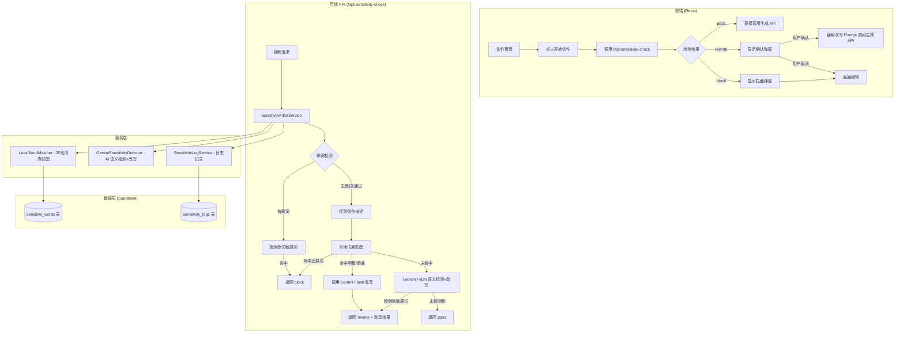

# 技术设计文档：敏感词拦截与智能提示词改写

## Overview

本设计为 HookCraft AI 音乐生成平台实现敏感词拦截与智能提示词改写功能。系统采用**双层检测架构**：本地敏感词库快速匹配 + Gemini Flash 语义级检测，确保高频敏感词被快速拦截的同时，通过 AI 语义分析覆盖变体、昵称等复杂场景。

核心流程：
1. 用户点击【开始创作】→ 前端调用 `/api/sensitivity-check`
2. 后端先检测歌词（若有），再检测创作描述
3. 根据检测结果返回三种类型：`pass`（通过）、`rewrite`（需改写）、`block`（直接拦截）
4. 前端根据结果展示对应弹窗或直接进入生成流程

设计目标：
- **低延迟**：本地匹配 < 50ms，整体检测+改写 < 3s
- **高准确率**：双层检测覆盖精确匹配和语义变体
- **无缝集成**：作为独立 API 端点，不侵入现有生成流水线
- **可运营**：管理后台支持敏感词库 CRUD，实时生效

## Architecture



### 架构决策

1. **单次 API 调用合并检测与改写**：将敏感词检测和 Prompt 改写合并为一次 Gemini Flash 调用，减少网络延迟。本地词库命中时仍需调用 Gemini 进行改写（但跳过检测步骤）。

2. **歌词优先检测**：歌词中的敏感词直接拦截（不改写），因此优先检测歌词可避免不必要的描述检测和改写 API 调用。

3. **内存缓存 + 定时刷新**：敏感词库启动时加载到内存，每 60 秒检查更新，确保本地匹配延迟 < 50ms。

4. **降级策略**：Gemini Flash 调用失败时，仅依赖本地词库结果。若本地未命中则放行（不阻塞用户），同时记录错误日志。

## Components and Interfaces

### 1. SensitivityFilterService（核心服务）

```typescript
// src/lib/sensitivity/SensitivityFilterService.ts

export class SensitivityFilterService {
  private localMatcher: LocalWordMatcher;
  private geminiDetector: GeminiSensitivityDetector;
  private logService: SensitivityLogService;

  constructor(deps: {
    supabase: SupabaseClient<Database>;
    geminiApiKey: string;
  });

  /**
   * 执行完整的敏感词检测流程
   * 1. 若有歌词，先检测歌词
   * 2. 再检测创作描述
   * 3. 返回结构化结果
   */
  async check(input: SensitivityCheckInput): Promise<SensitivityCheckResult>;
}
```

### 2. LocalWordMatcher（本地词库匹配器）

```typescript
// src/lib/sensitivity/LocalWordMatcher.ts

export class LocalWordMatcher {
  private wordCache: SensitiveWordEntry[];
  private lastRefreshTime: number;

  constructor(supabase: SupabaseClient<Database>);

  /** 初始化：从数据库加载词库到内存 */
  async initialize(): Promise<void>;

  /** 刷新缓存（若距上次刷新超过 60s） */
  async refreshIfNeeded(): Promise<void>;

  /** 对文本执行本地匹配，返回命中的敏感词列表 */
  match(text: string): LocalMatchResult;
}
```

### 3. GeminiSensitivityDetector（AI 语义检测+改写）

```typescript
// src/lib/sensitivity/GeminiSensitivityDetector.ts

export class GeminiSensitivityDetector {
  private ai: GoogleGenAI;

  constructor(apiKey: string);

  /**
   * 单次 Gemini Flash 调用，同时完成：
   * - 语义级敏感词检测
   * - Prompt 改写（若检测到明星/歌曲名称）
   * - Style Tags 提取
   */
  async detectAndRewrite(input: DetectAndRewriteInput): Promise<DetectAndRewriteResult>;

  /**
   * 仅改写（本地已命中明星/歌曲名称时使用）
   * 跳过检测步骤，直接改写
   */
  async rewriteOnly(input: RewriteOnlyInput): Promise<RewriteResult>;
}
```

### 4. SensitivityLogService（日志服务）

```typescript
// src/lib/sensitivity/SensitivityLogService.ts

export class SensitivityLogService {
  constructor(supabase: SupabaseClient<Database>);

  /** 记录检测日志 */
  async log(entry: SensitivityLogEntry): Promise<void>;

  /** 查询检测日志（管理后台用） */
  async getLogs(params: LogQueryParams): Promise<SensitivityLog[]>;

  /** 更新命中次数统计 */
  async incrementHitCount(wordIds: string[]): Promise<void>;
}
```

### 5. SensitiveWordAdminService（管理后台服务）

```typescript
// src/lib/sensitivity/SensitiveWordAdminService.ts

export class SensitiveWordAdminService {
  constructor(supabase: SupabaseClient<Database>);

  /** 获取敏感词列表（支持分页、筛选） */
  async list(params: WordListParams): Promise<{ words: SensitiveWordEntry[]; total: number }>;

  /** 新增敏感词 */
  async create(input: CreateWordInput): Promise<SensitiveWordEntry>;

  /** 编辑敏感词 */
  async update(id: string, input: UpdateWordInput): Promise<SensitiveWordEntry>;

  /** 删除敏感词 */
  async delete(id: string): Promise<void>;

  /** 批量导入敏感词 */
  async batchImport(input: BatchImportInput): Promise<{ imported: number; skipped: number }>;
}
```

### 6. API 端点

```typescript
// src/app/api/sensitivity-check/route.ts
// POST /api/sensitivity-check

// src/app/api/admin/sensitive-words/route.ts
// GET /api/admin/sensitive-words - 获取敏感词列表
// POST /api/admin/sensitive-words - 新增敏感词

// src/app/api/admin/sensitive-words/[id]/route.ts
// PUT /api/admin/sensitive-words/[id] - 编辑敏感词
// DELETE /api/admin/sensitive-words/[id] - 删除敏感词

// src/app/api/admin/sensitive-words/batch/route.ts
// POST /api/admin/sensitive-words/batch - 批量导入

// src/app/api/admin/sensitivity-logs/route.ts
// GET /api/admin/sensitivity-logs - 获取检测日志
```

### 7. 前端组件

```typescript
// src/components/studio/SensitivityConfirmDialog.tsx - 确认弹窗（rewrite 类型）
// src/components/studio/SensitivityBlockDialog.tsx - 拦截弹窗（block 类型）
// src/components/admin/SensitiveWordsManager.tsx - 管理后台敏感词管理页面
// src/components/admin/SensitivityLogsViewer.tsx - 管理后台检测日志页面
// src/hooks/useSensitivityCheck.ts - 前端检测 Hook
```

## Data Models

### 数据库表结构

#### sensitive_words 表（敏感词库）

| 字段 | 类型 | 说明 |
|------|------|------|
| id | uuid | 主键 |
| word | text | 敏感词内容 |
| category | text | 分类：celebrity / song_name / forbidden |
| variants | text[] | 关联变体词列表 |
| note | text | 备注说明 |
| hit_count | integer | 命中次数 |
| last_hit_at | timestamptz | 最近命中时间 |
| created_at | timestamptz | 创建时间 |
| updated_at | timestamptz | 更新时间 |

#### sensitivity_logs 表（检测日志）

| 字段 | 类型 | 说明 |
|------|------|------|
| id | uuid | 主键 |
| user_id | uuid | 用户 ID |
| input_description | text | 原始创作描述 |
| input_lyrics | text | 原始歌词（可为空） |
| result_type | text | 检测结果：pass / rewrite / block |
| detected_words | jsonb | 检测到的敏感词列表 |
| rewritten_prompt | text | 改写后的 Prompt（仅 rewrite 时有值） |
| style_tags | text[] | 风格标签（仅 rewrite 时有值） |
| user_confirmed | boolean | 用户是否确认继续（仅 rewrite 时有值） |
| detection_source | text | 检测来源：local / gemini / both |
| duration_ms | integer | 检测耗时（毫秒） |
| created_at | timestamptz | 创建时间 |

### TypeScript 类型定义

```typescript
// src/types/sensitivity.ts

/** 敏感词分类 */
export type SensitiveWordCategory = 'celebrity' | 'song_name' | 'forbidden';

/** 检测结果类型 */
export type SensitivityResultType = 'pass' | 'rewrite' | 'block';

/** 敏感词条目 */
export interface SensitiveWordEntry {
  id: string;
  word: string;
  category: SensitiveWordCategory;
  variants: string[];
  note: string;
  hitCount: number;
  lastHitAt: string | null;
  createdAt: string;
  updatedAt: string;
}

/** 检测请求输入 */
export interface SensitivityCheckInput {
  description: string;       // 创作描述
  lyrics?: string;           // 自定义歌词（可选）
}

/** 检测结果 */
export interface SensitivityCheckResult {
  passed: boolean;
  resultType: SensitivityResultType;
  descriptionResult: DescriptionCheckResult | null;
  lyricsResult: LyricsCheckResult | null;
  rewrittenPrompt: string | null;
  styleTags: string[] | null;
  blockedWords: string[] | null;
  durationMs: number;
}

/** 创作描述检测结果 */
export interface DescriptionCheckResult {
  type: SensitivityResultType;
  detectedWords: DetectedWord[];
}

/** 歌词检测结果 */
export interface LyricsCheckResult {
  type: 'pass' | 'block';
  detectedWords: DetectedWord[];
}

/** 检测到的敏感词 */
export interface DetectedWord {
  word: string;
  category: SensitiveWordCategory;
  source: 'local' | 'gemini';
}

/** 本地匹配结果 */
export interface LocalMatchResult {
  matched: boolean;
  words: Array<{
    word: string;
    category: SensitiveWordCategory;
    matchedVariant?: string;  // 实际匹配到的变体
  }>;
}

/** Gemini 检测+改写输入 */
export interface DetectAndRewriteInput {
  description: string;
  knownSensitiveWords?: string[];  // 本地已匹配到的词（辅助 Gemini）
}

/** Gemini 检测+改写结果 */
export interface DetectAndRewriteResult {
  hasSensitiveContent: boolean;
  detectedWords: Array<{
    word: string;
    category: SensitiveWordCategory;
  }>;
  rewrittenPrompt: string | null;
  styleTags: string[] | null;
  hasForbiddenWords: boolean;
  forbiddenWords: string[];
}

/** 仅改写输入 */
export interface RewriteOnlyInput {
  description: string;
  sensitiveWords: string[];
}

/** 改写结果 */
export interface RewriteResult {
  rewrittenPrompt: string;
  styleTags: string[];
}

/** 检测日志条目 */
export interface SensitivityLogEntry {
  userId: string;
  inputDescription: string;
  inputLyrics?: string;
  resultType: SensitivityResultType;
  detectedWords: DetectedWord[];
  rewrittenPrompt?: string;
  styleTags?: string[];
  userConfirmed?: boolean;
  detectionSource: 'local' | 'gemini' | 'both';
  durationMs: number;
}
```


## Correctness Properties

*A property is a characteristic or behavior that should hold true across all valid executions of a system—essentially, a formal statement about what the system should do. Properties serve as the bridge between human-readable specifications and machine-verifiable correctness guarantees.*

### Property 1: Result type classification is determined by word category

*For any* input text and sensitive word library, the result type SHALL be determined solely by the category of detected sensitive words: if forbidden words are detected the result is `block`, if only celebrity/song_name words are detected the result is `rewrite`, and if no sensitive words are detected the result is `pass`. Furthermore, `block` takes priority over `rewrite` (if both forbidden and celebrity words are present, the result is `block`).

**Validates: Requirements 1.3, 1.4, 1.5, 1.8**

### Property 2: Style tags count invariant

*For any* rewrite result produced by the Prompt_Rewriter, the number of style tags SHALL be between 2 and 5 inclusive.

**Validates: Requirements 2.3**

### Property 3: Rewritten prompt contains no sensitive words

*For any* rewrite result, running the local word matcher against the rewritten prompt SHALL return zero matches. The rewritten prompt must not contain any word from the sensitive word library (including variants).

**Validates: Requirements 2.5**

### Property 4: Lyrics sensitive words always result in block

*For any* lyrics text containing any type of sensitive word (celebrity, song_name, or forbidden), the lyrics check result SHALL always be `block`. Unlike creation descriptions, lyrics do not support the `rewrite` path.

**Validates: Requirements 4.2, 4.5**

### Property 5: Lyrics block short-circuits description processing

*For any* input where lyrics contain sensitive words, the description check SHALL not be performed (no Gemini API call for description detection/rewrite). The overall result SHALL be `block` based on lyrics alone.

**Validates: Requirements 4.6**

### Property 6: API response structure completeness

*For any* valid sensitivity check request (with description and optional lyrics), the API response SHALL always contain all required fields: `passed` (boolean), `resultType` (one of pass/rewrite/block), `descriptionResult`, `lyricsResult`, `rewrittenPrompt`, `styleTags`, `blockedWords`, and `durationMs`. When lyrics are provided, `lyricsResult` SHALL be non-null.

**Validates: Requirements 6.3, 6.6**

### Property 7: Variant matching covers all registered forms

*For any* sensitive word entry with registered variants, the local matcher SHALL match the text when it contains any of the registered variants. Specifically, if a word has variants `[v1, v2, ..., vn]`, then for any text containing any `vi`, the matcher SHALL report a match for that word.

**Validates: Requirements 7.5**

### Property 8: Batch import preserves all valid entries

*For any* batch import input containing N distinct valid sensitive words, the import operation SHALL result in exactly N new entries in the database (minus any that already exist as duplicates). The imported entries SHALL preserve the original word content and category assignment.

**Validates: Requirements 8.5**

## Error Handling

### Gemini Flash 调用失败

| 场景 | 处理策略 | 用户影响 |
|------|----------|----------|
| Gemini API 超时（>3s） | 仅依赖本地词库结果，若本地未命中则放行 | 无感知，正常进入生成 |
| Gemini API 返回错误 | 同上，记录错误日志 | 无感知 |
| Gemini 返回格式异常 | 解析失败时视为未检测到敏感词，放行 | 无感知 |
| 本地词库命中但 Gemini 改写失败 | 返回错误，提示用户手动修改描述 | 看到错误提示 |

### 本地词库异常

| 场景 | 处理策略 | 用户影响 |
|------|----------|----------|
| 数据库连接失败 | 使用内存中的旧缓存继续服务 | 无感知 |
| 缓存为空（首次启动失败） | 跳过本地匹配，直接调用 Gemini | 可能略慢 |
| 缓存刷新失败 | 保留旧缓存，下次重试 | 无感知 |

### 前端异常

| 场景 | 处理策略 | 用户影响 |
|------|----------|----------|
| /api/sensitivity-check 请求失败 | 允许用户继续生成（降级） | Toast 提示网络异常 |
| 响应格式异常 | 视为 pass，允许继续 | 无感知 |
| 弹窗渲染失败 | 降级为 alert 提示 | 体验略差但功能正常 |

### 错误日志记录

所有异常情况均记录到 `sensitivity_logs` 表，包含：
- 错误类型和错误消息
- 请求输入（脱敏后）
- 发生时间
- 降级策略是否生效

## Testing Strategy

### 测试框架

- **单元测试 & 属性测试**：Vitest + fast-check
- **组件测试**：Vitest + React Testing Library（若项目已配置）
- **集成测试**：Vitest + Supabase mock

### 属性测试（Property-Based Testing）

本功能的核心逻辑（敏感词分类、匹配、结果判定）适合属性测试。使用 `fast-check` 库，每个属性测试运行最少 100 次迭代。

**测试文件结构**：
```
src/lib/sensitivity/__tests__/
├── SensitivityFilterService.property.test.ts  (Properties 1, 4, 5, 6)
├── LocalWordMatcher.property.test.ts          (Property 7)
├── GeminiSensitivityDetector.property.test.ts (Properties 2, 3)
└── SensitiveWordAdminService.property.test.ts (Property 8)
```

**属性测试配置**：
- 每个属性测试最少 100 次迭代
- 每个测试标注对应的设计属性编号
- 标签格式：`Feature: prompt-sensitivity-filter, Property {number}: {property_text}`

### 单元测试

| 测试目标 | 测试内容 |
|----------|----------|
| LocalWordMatcher | 精确匹配、模糊匹配、大小写处理、空输入 |
| GeminiSensitivityDetector | Prompt 构建、响应解析、超时处理 |
| SensitivityFilterService | 完整流程（mock Gemini）、降级策略、优先级逻辑 |
| SensitiveWordAdminService | CRUD 操作、批量导入去重、输入验证 |
| API Route | 请求验证、认证检查、响应格式 |

### 集成测试

| 测试目标 | 测试内容 |
|----------|----------|
| /api/sensitivity-check | 端到端请求响应、认证、错误处理 |
| /api/admin/sensitive-words | CRUD 端点、权限验证 |
| 缓存刷新 | 数据库修改后缓存更新 |
| 执行顺序 | 歌词优先检测、本地优先于 Gemini |

### 前端组件测试

| 测试目标 | 测试内容 |
|----------|----------|
| SensitivityConfirmDialog | 渲染、按钮交互、风格标签展示 |
| SensitivityBlockDialog | 渲染、违禁词高亮、关闭行为 |
| useSensitivityCheck | 状态管理、加载状态、错误处理 |
